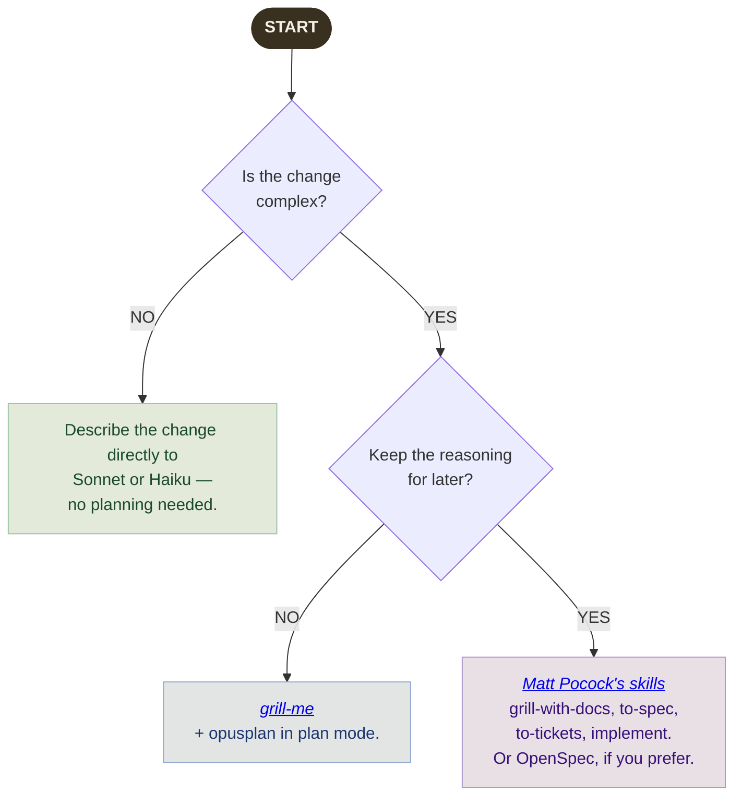

## Model overview

We work with three models, each with its own price and job. A good rule of thumb is to start with the most affordable one that can handle the task well.

| Model                                                 | Model ID            | Context | Input&nbsp;$/1M | Output&nbsp;$/1M | Role                                            |
| ----------------------------------------------------- | ------------------- | ------- | --------------- | ---------------- | ----------------------------------------------- |
| Claude Opus 5.5      | `claude-opus-5-5`   | 1M      | $4.00           | $20.00           | Planning, architecture, and anything open-ended |
| Claude Sonnet 5.5  | `claude-sonnet-5-5` | 1M      | $2.00           | $10.00           | Implementation and everyday work                |
| Claude Haiku 4.5    | `claude-haiku-4-5`  | 200K    | $1.00           | $5.00            | Fast, light, simple tasks                       |

Prices are [Anthropic API list prices](https://platform.claude.com/docs/en/about-claude/pricing) per million tokens, as of October 2026. We use Claude through a subscription, so the same price differences show up as how quickly you use your limits rather than as dollars. Opus costs about twice as much as Sonnet, so it uses your allowance about twice as fast.

You'll need a recent version of Claude Code for the newest models: v2.1.280 or later for Opus 5.5, and v2.1.284 or later for Sonnet 5.5. If a model isn't available, run `claude update`.

> [!TIP]
> A good default: plan with Opus, build with Sonnet.
>
> Opus shines when a problem is vague or open-ended, because that's where its thinking pays off. Once you have a clear plan, Sonnet can carry it out for about half the price and gets you to the same place. Opus can absolutely write code too. To decide which model and effort level suit a particular piece of work, see our [model and effort guide](choosing-a-model.html).

---

## How to approach a change

Take a moment to pick a workflow before you write your first prompt. These three questions will get you there:

1. **Is the change simple?** Describe what you want directly to Sonnet or Haiku. No planning needed.
2. **Is it medium-sized, and you only need a plan?** Use `opusplan` with [grill-me](https://www.aihero.dev/my-grill-me-skill-has-gone-viral) in plan mode.
3. **Is it big, or do you want to keep the reasoning for later?** Use [Matt Pocock's skills](matt-pocock-skills.html). They plan the work with you and save the domain knowledge and decisions in the repo. [OpenSpec](https://github.com/Fission-AI/OpenSpec/) is an alternative if you prefer it.

---

## Medium complexity: `opusplan` + `grill-me`

For changes that are too involved to describe in one go but don't need a lasting record of the reasoning, `opusplan` with `grill-me` is a lovely place to start. It's also a great default if you're newer to Claude: a simple plan-then-implement flow that works well most of the time, with no manual model switching.

Select the `opusplan` model and invoke [`grill-me`](https://www.aihero.dev/my-grill-me-skill-has-gone-viral) from plan mode. Opus explores the codebase and talks the problem through with you, then produces a plan. Once you approve it, `opusplan` hands off to Sonnet for the implementation.

1. Select the `opusplan` model and enter plan mode.
2. Invoke `grill-me`. Opus looks through the codebase and asks clarifying questions, surfacing edge cases, hidden assumptions, and possible failure modes. Your starting input can be rough.
3. Answer the questions. When the conversation wraps up, Opus writes a well-informed plan for you to review.
4. Approve the plan. `opusplan` switches to Sonnet to implement it.

As you get more comfortable with Claude, feel free to mix and match: choose your own model for each step, adjust effort levels, or skip planning entirely for small tasks. The [model and effort guide](choosing-a-model.html) is there when you're ready.

`grill-me` is one of Matt Pocock's skills. When the work needs more than a plan, the rest of his skills take over.

---

## Bigger work: Matt Pocock's skills

Some work has a strong domain component, such as custom business logic, non-obvious architectural constraints, or decisions with long-term consequences. For that kind of work, it helps to capture the _why_ alongside the plan, so that future implementers (human or AI) understand the reasoning and not just the outcome.

[Matt Pocock's skills](matt-pocock-skills.html) do this. They go well past `grill-me`: they take a change from the first questions to a spec, small tickets, test-first code and a review. On the way, they save the project's shared words in `CONTEXT.md` and the decisions in ADRs (short decision records), next to the code.

### When this is a good fit

- The feature touches domain rules that aren't obvious from the code.
- There are real trade-offs between approaches that are worth recording.
- A future developer would otherwise have to reverse-engineer the intent.
- You expect to revisit this area and want the context to still make sense in six months.

The skills change often, so we don't copy the steps here. See [Using Matt Pocock's Skills](matt-pocock-skills.html) for how to install them, and for links to Matt's docs and videos.

> [!TIP]
> Plan with Opus, build with Sonnet
>
> The same model split works here. Use Opus for the grilling and the spec, then open a new window with Sonnet for the tickets and the code.

---

## Alternative: OpenSpec

[OpenSpec](https://github.com/Fission-AI/OpenSpec/) is another way to keep the _why_ in the repo. A spec document is committed alongside the code. Use it instead of Matt's skills if you prefer how it works.

1. Open a fresh conversation with Opus. Its 1M context gives you plenty of room for background docs, existing code, and a long planning discussion.
2. Work through the problem with Opus, weigh the options, and arrive at a plan.
3. Ask Opus to write the spec. It should capture the goal, the options you considered, the decision you made, and the reasons why.
4. Open a new window with Sonnet and hand it the spec. Sonnet carries out the plan, and you save your Opus usage for the thinking.

---

## Context management: stay or start fresh?

Every conversation builds up context, so at some point you'll choose between carrying on in the same window and starting a new one. One thing worth knowing: each model keeps its own cache, so switching models with `/model` in the middle of a session means the new model has to reread the whole conversation from scratch. You pay that cost once per switch, and it can eat into the savings from moving to a cheaper model.

**After a short planning session.** If the session was short and the plan is modest, there's no need to switch. Stay with the model you started on, or use `opusplan` and let it do the handoff for you.

**After a long planning session.** If planning and exploration have used up most of your context, end the session with a handover document and open a fresh window on Sonnet. A new window has no cache to lose, and Sonnet gets the distilled insight without wading through the whole conversation. Matt's `/handoff` skill writes this document for you.

A good handover document includes:

- the decision that was made
- the reasoning behind it
- any constraints you uncovered
- the exact next steps

Paste it into the new window as your opening prompt. Even when two models have the same context window, a long planning conversation is noisy, so ask the current session to write the handover document before you move on. It only takes a minute and makes the next step much smoother.

---

## Quick reference

| Situation                                  | Approach                                             | Model                                                                     |
| ------------------------------------------ | ---------------------------------------------------- | ------------------------------------------------------------------------- |
| Simple change, no planning needed          | Describe the change directly                         |  or  |
| Vague or open-ended request                | Think it through with Opus first                     |                                          |
| Complex, no reasoning to keep | `opusplan` + `grill-me` in plan mode | `opusplan` |
| Complex, reasoning worth keeping | Matt Pocock's skills (or OpenSpec): plan and spec in Opus, build in Sonnet |  →  |
| You have a good plan                       | Implement it                                         |                                        |

Not sure which setup fits your task? Our [model and effort guide](choosing-a-model.html) goes deeper.
