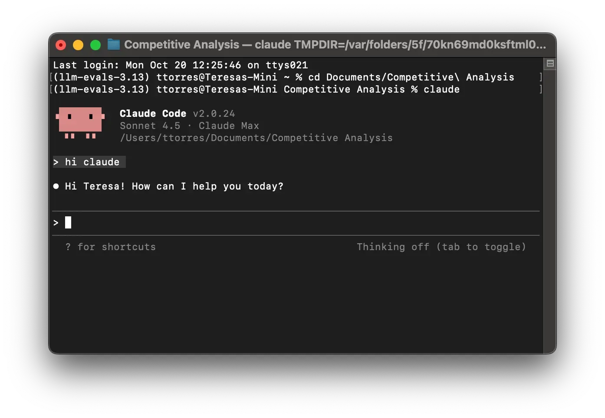
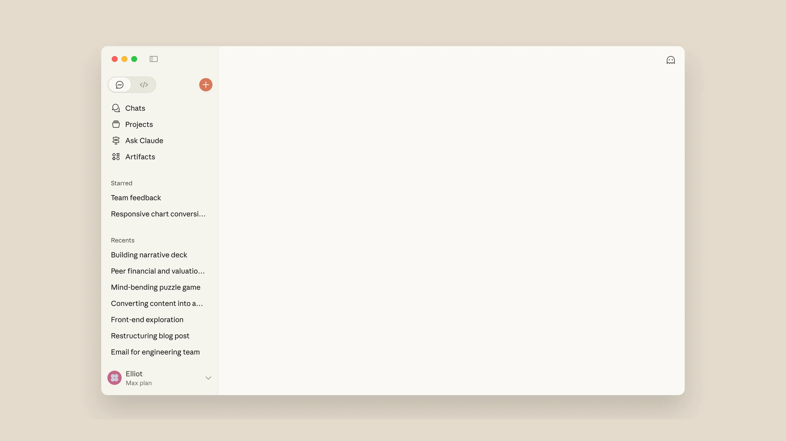
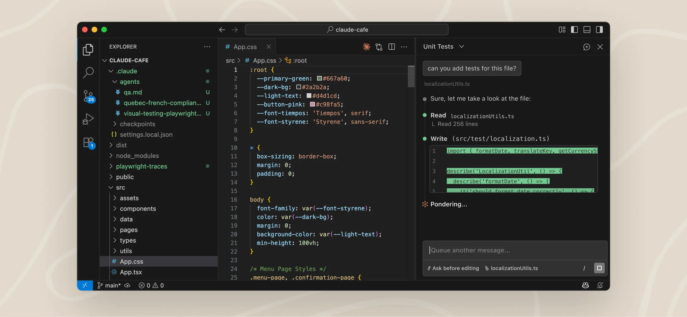

## Overview

You can run Claude Code in three ways: in the terminal, in the desktop app, or as a VS Code extension. All three connect to the same Claude Code engine, so your repo's CLAUDE.md files, settings and MCP servers work in each one. You don't have to pick just one: running all three side by side is totally viable, and you can use whichever fits the task at hand. The VS Code extension and the CLI share conversation history, and the CLI's `/desktop` command continues a terminal session in the desktop app (macOS and x64 Windows).

| Option | Best for | Install |
|---|---|---|
| Terminal (CLI) | The full-featured CLI: edit files, run commands, script and automate | One-line installer, Homebrew or WinGet |
| Desktop app | A visual interface: review diffs, run sessions side by side, schedule tasks | Download for macOS or Windows |
| VS Code extension | Staying in your editor with inline diffs, @-mentions and plan review | Install from the Extensions view |

Most options need a Claude subscription or an Anthropic Console account, and the desktop app requires a paid subscription. Source: [Claude Code overview](https://code.claude.com/docs/).

---

## Option 1: Claude Code in the terminal

The terminal CLI is the full-featured way to use Claude Code: it edits files, runs commands and manages your whole project from the command line. The native installer is the recommended method and updates itself in the background.

**Install**: copy the command for your system from the official docs, since install commands change between releases.

The [Claude Code overview](https://code.claude.com/docs/) (Terminal tab) lists the native installer for macOS, Linux, WSL and Windows, plus Homebrew and WinGet. [Advanced setup](https://code.claude.com/docs/en/setup) covers other methods, updates and uninstalling. On native Windows, [Git for Windows](https://git-scm.com/downloads/win) is recommended.

### Check and start

1. Open a new terminal window and run `claude --version`. A version number means it worked.
2. Go to your project folder (`cd your-project`) and run `claude`.
3. Log in when prompted on first use.
{: .flow-steps}

Links: [Quickstart](https://code.claude.com/docs/en/quickstart) · [Terminal guide for first-time terminal users](https://code.claude.com/docs/en/terminal-guide) · [Advanced setup](https://code.claude.com/docs/en/setup) · [Installation troubleshooting](https://code.claude.com/docs/en/troubleshoot-install)

---

## Option 2: Claude Code desktop app

The desktop app runs Claude Code in a standalone window, so you don't need a terminal or an IDE. It has a **Code** tab where each conversation is its own session with separate chat history, project folder and code changes, and you can review Claude's diffs visually. Claude Code is bundled, so you don't install the CLI separately.

### Install

1. Download the installer: [macOS](https://claude.ai/api/desktop/darwin/universal/dmg/latest/redirect?utm_source=claude_code&utm_medium=docs) (Intel and Apple Silicon), [Windows x64](https://claude.ai/api/desktop/win32/x64/setup/latest/redirect?utm_source=claude_code&utm_medium=docs) or [Windows ARM64](https://claude.ai/api/desktop/win32/arm64/setup/latest/redirect?utm_source=claude_code&utm_medium=docs).
2. Launch Claude and sign in. A paid subscription is required.
3. Click the **Code** tab at the top, choose a project folder and give Claude a task.
{: .flow-steps}

By default the Code tab starts in Ask permissions mode, where Claude proposes changes and waits for your approval before applying them. On Ubuntu or Debian the app is in beta; see the [Linux install instructions](https://code.claude.com/docs/en/desktop-linux).

Links: [Desktop quickstart](https://code.claude.com/docs/en/desktop-quickstart) · [Full desktop reference](https://code.claude.com/docs/en/desktop) · [Claude Desktop support articles](https://support.claude.com/en/collections/16163169-claude-desktop)

---

## Option 3: Claude Code VS Code extension

The VS Code extension is the recommended way to use Claude Code inside VS Code. It adds a graphical chat panel with inline diffs, @-mentions of files and line ranges, plan review and conversation history, and it also installs in forks such as Cursor.

**Prerequisites:** VS Code 1.94.0 or later, and a paid Claude subscription (Pro, Max, Team or Enterprise) or a Claude Console account. No API key is required.

### Install

1. Click Install for VS Code (or Install for Cursor). Alternatively, open the Extensions view (`Cmd+Shift+X` on Mac, `Ctrl+Shift+X` on Windows/Linux), search for "Claude Code" and click **Install**.
2. If the extension doesn't appear, restart VS Code or run "Developer: Reload Window" from the Command Palette.
3. Open a file and click the Spark icon in the top-right of the editor toolbar to open the Claude Code panel.
4. Click **Sign in** and finish authorization in your browser.
{: .flow-steps}

> Want `claude` in the terminal too?
>
> The extension bundles its own copy of the CLI for the chat panel but does not put `claude` on your PATH. To run `claude` in VS Code's integrated terminal, also install the standalone CLI from Option 1.
{: .callout .callout-info}

Links: [VS Code extension guide](https://code.claude.com/docs/en/vscode-extension) · [Marketplace listing](https://marketplace.visualstudio.com/items?itemName=anthropic.claude-code) · [Troubleshooting](https://code.claude.com/docs/en/troubleshooting)

---

## Useful links

- [Claude Code overview](https://code.claude.com/docs/): all surfaces and install methods in one place
- [Quickstart](https://code.claude.com/docs/en/quickstart): your first real task, from exploring a codebase to committing a fix
- [Common workflows](https://code.claude.com/docs/en/common-workflows) and [best practices](https://code.claude.com/docs/en/best-practices)
- [Settings](https://code.claude.com/docs/en/settings): shared between the terminal, desktop app and VS Code extension
- [Troubleshooting](https://code.claude.com/docs/en/troubleshooting)
- [Claude Academy](https://academy.claude.com/): free self-paced courses, including [Claude Code 101](https://academy.claude.com/courses/claude-code-101)
- [Pricing](https://claude.com/pricing)

Sources: pages on code.claude.com opened on the update date above.
