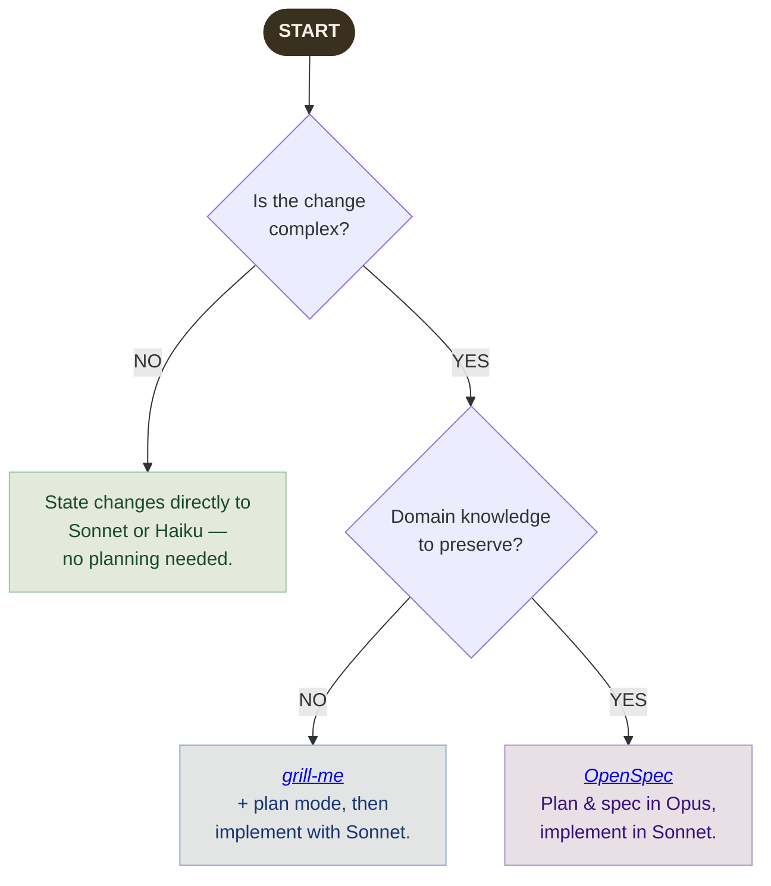

## Model Overview

Three models, three price tiers, clear roles. Pick the cheapest model that is capable enough for the job.

| Model | Model ID | Context | Input&nbsp;$/1M | Output&nbsp;$/1M | Role |
|---|---|---|---|---|---|
| Claude Opus 4.8  | `claude-opus-4-8` | 1M | $5.00 | $25.00 | Planning, architecture, specs |
| Claude Sonnet 4.6  | `claude-sonnet-4-6` | 1M | $3.00 | $15.00 | Implementation, everyday work |
| Claude Haiku 4.5  | `claude-haiku-4-5` | 200K | $1.00 | $5.00 | Fast, cheap, simple tasks |

> Never use Opus to write code
>
> Opus costs up to 5&times; more per token than Sonnet. Its purpose is to think through problems and produce plans that cheaper models can execute. Using Opus to implement code is wasteful and offers no meaningful quality gain for routine engineering work. Once a plan exists, switch to Sonnet or Haiku.
{: .callout .callout-warning}

---

## How to Approach a Change

Use this chart to pick the right workflow before you write a single prompt.

---

## Medium Complexity — `opusplan` + `grill-me`

For changes that are too involved to state directly but don't require capturing domain knowledge, select the `opusplan` model and invoke [`grill-me`](https://www.aihero.dev/my-grill-me-skill-has-gone-viral) from within plan mode. The two work as one: Opus researches the codebase and thinks through the problem with you via the grilling dialogue, then produces a plan. Once you approve it, `opusplan` switches to Sonnet for implementation automatically — no manual model switching needed.

1. Select the `opusplan` model and enter plan mode.
2. Invoke `grill-me`. Opus analyses the codebase and asks clarifying questions — surfacing edge cases, hidden assumptions, and failure modes. Your initial input can be rough.
3. Answer the questions. When the dialogue is done, Opus produces a well-informed plan. Review and approve it.
4. Accept the plan. `opusplan` automatically hands off to Sonnet for implementation.
{: .flow-steps}

> When this isn't enough
>
> `opusplan` caps at 200K tokens, which is enough for most day-to-day planning. If the problem involves domain knowledge, architectural trade-offs, or decisions that need to be understood months from now, use OpenSpec instead.
{: .callout .callout-info}

---

## OpenSpec — Domain Knowledge & Architecture

For work that has a strong domain component — custom business logic, non-obvious architectural constraints, decisions with long-term consequences — a plan alone is not enough. You also need to capture the *why* so that future implementers (human or AI) understand the reasoning, not just the outcome.

[OpenSpec](https://github.com/Fission-AI/OpenSpec/) is a workflow that does this. A spec document is committed alongside the code, making the rationale a first-class artifact in the repo.

### When to use OpenSpec

- The feature touches domain rules that are not obvious from the code.
- There are real trade-offs between approaches that need to be recorded.
- A future developer reading the code would otherwise have to reverse-engineer intent.
- You anticipate revisiting this area and want the context to still make sense in six months.

### Recommended workflow

1. Open a fresh conversation using full Opus — 1M context gives you room to include background docs, existing code, and long planning discussions.
2. Work with Opus to reason through the problem, weigh options, and produce a plan.
3. Ask Opus to write the spec document. It should capture the goal, the options considered, the decision made, and the reasons why.
4. Open a new window with Sonnet and hand it the spec. Sonnet implements the plan without burning expensive Opus tokens on routine code generation.
{: .flow-steps}

---

## Context Management — Stay or Start Fresh?

Every conversation accumulates context. At some point you need to decide: keep going in the same window, or open a new one and hand over a summary?

### Stay in the current chat when

- The context is not yet strained — the model can still hold everything comfortably.
- After a `grill-me` session, if the conversation was short and the plan is not super detailed, it is better to stay in the same window and just switch the model to a cheaper one.

### Start a new window when

- Most of the context has been consumed by planning and exploration that is now resolved.
- You used OpenSpec with full Opus — open a new window and switch to Sonnet, handing it the spec document as the opening prompt.

> Switching models after OpenSpec planning
>
> After planning in full Opus, do not carry the whole conversation into the implementation window. Distill the session into a precise handover document first — the decision made, the reasoning behind it, the constraints uncovered, and the exact next steps — then open a new window with Sonnet and use that document as the opening prompt.
{: .callout .callout-warning}

> Capture before you switch
>
> Even when context windows match, a long planning conversation is noisy. Ask the current session to produce a handover doc before switching — the new model gets the distilled insight without having to process the full dialogue.
{: .callout .callout-tip}

---

## Quick Reference

| Situation | Approach | Model |
|---|---|---|
| Simple change, no planning needed | State changes directly |  or  |
| Complex, no domain knowledge to preserve | `opusplan` + `grill-me` in plan mode | `opusplan` |
| Complex, domain knowledge must be preserved | OpenSpec — plan + spec in Opus, implement in Sonnet |  →  |
